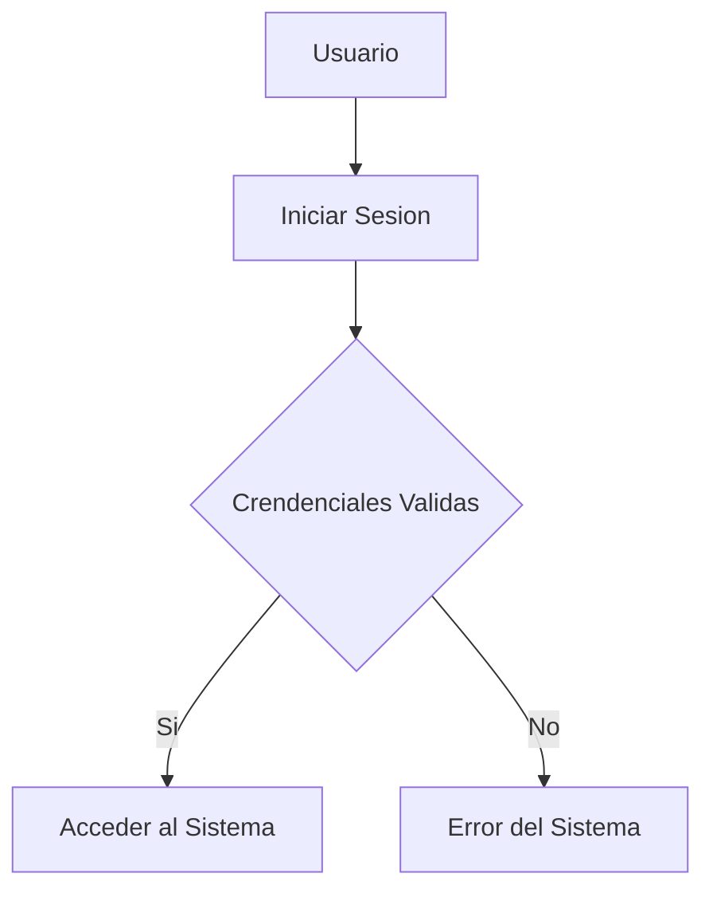
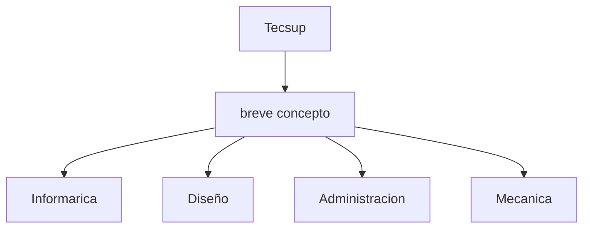

# Indice
- [Titulo](#titulo-importante)
- [Funciones](#funciones)
- [creando-tablas](#creando-tablas)
- [tablas](#mermaid-diagramas)
# Importante
Me encuentro aprendiendo *Markdown* en las clases con Pallin
## subtitulo 01
Aqui verificamos como formatear diferentes **tipos de textos**
## subtitulo 02
Podremos conocer diferetes tipos de formatos durante el texto usando ~~Markdown~~
### creando Hiperv
[google](http://www.google.com)
[tecsup](http://www.tecsup.edu.pe)

## Colocando Imagenes


## Funciones 
- [x] Registrar Alumno
- [x] Generar matricula
- [ ] campo vacio
- [ ] campo vacio

## Creando Tablas
| Lenguaje de programacion | creando |
|--------------------------|---------|
| Java |Jame Cosling |
| PHP  |Rasmus Lendor|
| Python | Gido Van Rossum |

## codigo 
```html
<h1>Hola mundo<h1>
```

```css
body {
        background:"red";
    }
```

```Java 
public class main {
    public static void main(string[] args){
        System.out.printLn("hola mundo");
    }
}

```JavaScript
```
## Mermaid Diagramas 


## Mermaid Diagrama 
